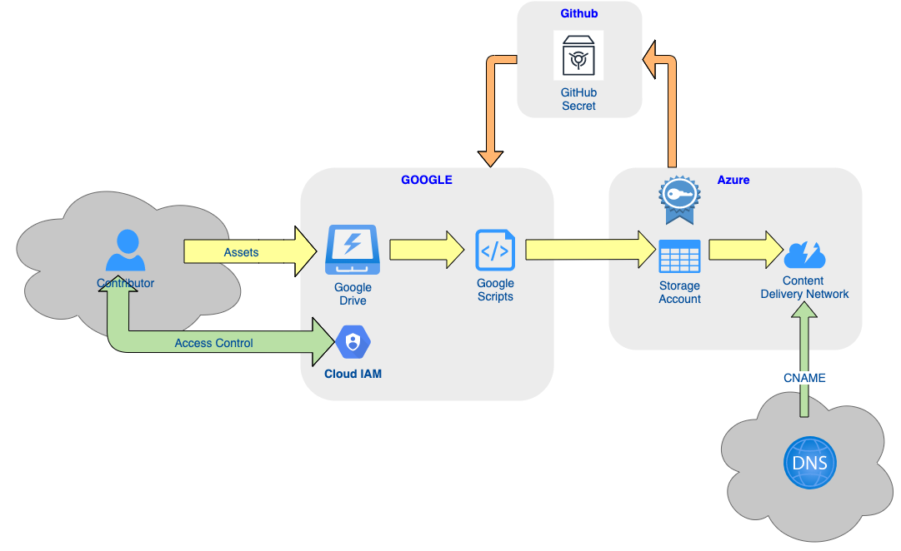

# Technical
Securly connecting Google Drive to Microsoft Azure, and providing a bespoke domain

## Google
### Google Drive
The [Shared drive](https://drive.google.com/drive/folders/0AJ6YEVtSfOQVUk9PVA) has been created by the [Digital Tools Support](https://sites.google.com/digital.education.gov.uk/digitaltools/home) team and **Manager** access has been granted to a number of team members.

Team members who need to manage assets can be granted **Contributor** access by any of the managers.

### Google Scripts
Periodically a [Google Script ](https://github.com/DFE-Digital/GITISContent/tree/main/Google) needs to run. This will transfer the assets from the [Shared drive](https://drive.google.com/drive/folders/0AJ6YEVtSfOQVUk9PVA) to Azure.

The script needs to have a [Azure SAS Key](https://docs.microsoft.com/en-us/azure/storage/common/storage-sas-overview) embedded into it, which gives access to the Azure Storage account. Since this key is vunerable, it is stored as a GitHub Secret and injected into the script at deployment time.

## Azure
### Storage Accounts
Within the Azure subscription s146-getintoteachingwebsite-production the [Storage Account](https://docs.microsoft.com/en-us/azure/storage/common/storage-account-overview?toc=/azure/storage/blobs/toc.json) **s146p01gitiscontent** has been created. This storage account has a container called "**content**" which has been set as a [Static Website](https://docs.microsoft.com/en-us/azure/storage/blobs/storage-blob-static-website)

A [Shared Access signature](https://docs.microsoft.com/en-us/azure/storage/common/storage-sas-overview) has been created for this [Storage Account](https://docs.microsoft.com/en-us/azure/storage/common/storage-account-overview?toc=/azure/storage/blobs/toc.json)

### Content Delivery Network
A [Content Delivery Network](https://docs.microsoft.com/en-gb/azure/cdn/cdn-overview) has been created for the  [Storage Account](https://docs.microsoft.com/en-us/azure/storage/common/storage-account-overview?toc=/azure/storage/blobs/toc.json) with the host name [assets-getintoteaching.azureedge.net] which has the custom domain [assets-getintoteaching.education.gov.uk]() attached to it.

### DNS
DNS needs to be configured by passing the details from Azure when you create the CDN to the CIP team using a Service Now Ticket.

## Github
### Secrets
The Azure [Shared Access signature](https://docs.microsoft.com/en-us/azure/storage/common/storage-sas-overview) key needs to be stored as a GitHub secret. This is to enable the pipeline 

